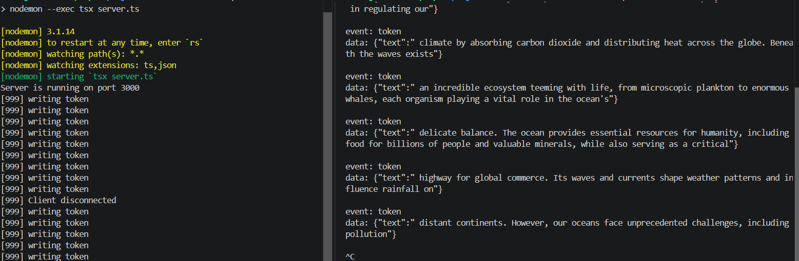
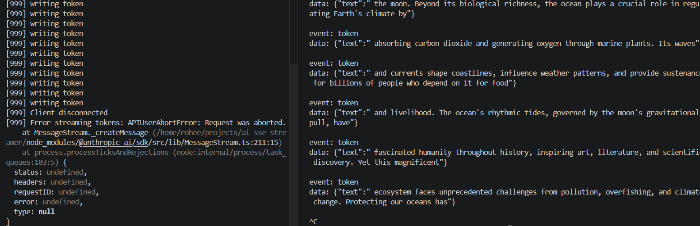

## Phase 0 — Naive baseline

**Background — why stream processing at all:**

1. Metric/log time grouping and bucketing using sliding window

2. change data capture - allows keeping derived data in SYNC with the database using a message broker which is specific to db. 

3. Event sourcing - instead of storing in db first and then use the message broker, we write directly to our broker and then pass to consumer and db. This database agnostic events allow us to build new types of derived data in the future. Caution: assumes broker holds onto events. The event is our source of truth in the message broker.

**The difference between in memory (queue-based) and log based message broker.**

An in-memory message broker stores messages temporarily in RAM, whereas a log-based message broker appends messages sequentially to persistent disk storage. An in-memory broker is queue-based, meaning messages are deleted once consumed, whereas log-based brokers retain immutable history for multiple readers. This is why we need to replay events using our Redis stream which is our durable log. 

**Decision:** I am building in phases, so this is Phase 0 — I have created the naive baseline. Now, to truly understand this from a distributed point of view, we need to verify it against a single client. In this naive baseline we only have a consumer. From what I have learned in stream processing, the typical architecture is a producer of some sort, a message broker which is a durable log, and a consumer of some sort. This architecture allows us to replay events. The whole point of stream processing is the ability to react to events as they're passed.

Before any of that, though, this phase actually starts one layer lower than streams — at the connection itself. Every `GET /stream/:id` request begins with a TCP three-way handshake (SYN, SYN-ACK, ACK) between client and server, which is what establishes the actual socket the rest of this sits on top of. What makes SSE possible at all is that this TCP connection is kept open (`Connection: keep-alive`) rather than closed after one request/response, the way a normal HTTP call would behave. `res.setHeader(...)` plus `res.flushHeaders()` sends the response headers immediately rather than waiting for the first `write()` or `end()` — normally Node buffers headers until there's a body to send them with, so flushing early is what tells the client "the connection is open, start listening" before any tokens exist yet. Because the total response size isn't known upfront, Node applies `Transfer-Encoding: chunked` automatically — every `res.write()` call becomes one length-prefixed chunk on the wire, which is also why a killed connection produces a clean cutoff rather than a corrupted partial chunk: each `write()` is already a complete, self-terminating unit.

**Alternatives considered:** Initially the thought was that for multiple clients we'd still target the abort per-client, the same way as the single-client case. That's wrong, and worth stating precisely: with more than one client attached to the same stream, we can't abort just because *one* client's `req.on('close')` fires — that would kill generation for every other client still watching. What multiple clients actually needs is the `Map`/`Set` reaching empty as the trigger, not any individual disconnect.

**What broke before the fix:**

Three failures were exposed during this experiment:

1. Tokens vanish on disconnect, with no memory of what was sent. Killing the stream mid-stream leaves nothing behind — no buffer, no log — so a reconnecting client cannot resume from what was left. This is exactly the next stage: using `EventSource`'s `Last-Event-ID` and a ring buffer, then a durable log stream such as Redis Streams.

2. `res.write()` doesn't throw on a dead socket, and nothing pauses the generation. `req.on('close')` is itself a networking-level signal, not an SSE-specific one — it's Node's `http` module surfacing the underlying TCP disconnect (a FIN or RST on the socket) as a JavaScript event. When it fired on client disconnect, `writing token` kept printing afterward, several times, with no error. The AI call has no idea the client has left — it keeps generating and billing for the full response regardless. The fix here for the single-client case is `AbortController`, wired from `req.on('close')` straight to `controller.signal` in the SDK call which allows us to abort the web request.

   before: 
   after: 

3. However, this is only correct for a single client — for multiple clients, aborting per-disconnect is wrong; the trigger needs to be the shared `Set<res>` for that streamId reaching empty, not any one client leaving. One important thing to note here is that these are synchronous calls — in this simple architecture there's no intermediary; this is `sse.ts` passing `signal` into `aiProvider.ts` as a function argument, so we have a reliable reference. As soon as we introduce Redis Streams we have an asynchronous pattern, a message broker — decoupled, but no longer a direct reference we can call into.

   The importance is realising our system needs to react to events (hence EventSource) — we store the events themselves rather than relying on CDC. Change Data Capture propagates changes already made to some underlying database; what we're doing instead treats the events as the source of truth directly, with nothing underneath them to capture from.

**Reading applied:**

- Backend from First Principles (Sriniously) understanding HTTP for backend engineers — the umbrella framing for long-lived connections, push vs. pull, and SSE vs. WebSockets vs. polling, which is what motivated understanding the TCP handshake and keep-alive behavior above rather than treating `res.write()` as a black box. Haven't watched the entire episode yet but bits needed to understand HTTP metadata.
- NJDP ch.3 (Callbacks and Events) — SSE as fundamentally an EventEmitter-shaped problem; `req`/`res` being `EventEmitter` instances. This is where I learnt about the reactor pattern and the internals of how JS works under the hood. The reactor pattern is the event loop + event demultiplexer that lets a single thread handle many concurrent I/O operations, implemented in Node by libuv. Callbacks are functions triggered to handle the result of an operation, needed when working with asynchronous tasks like our AI SDK call. The observer pattern defines an object (called the subject) that can notify a set of observers (or listeners) when a change in state occurs — which is what the `EventEmitter` class is; we listen to events and react to them. One correction to my own understanding here: I'd conflated the reactor pattern's event loop with libuv's *separate* thread pool. The thread pool only handles the specific things that can't be done non-blocking at the OS level — `fs` operations, `dns.lookup()`, some `crypto`/`zlib` calls. Network sockets (TCP, HTTP, our SSE connections) never touch the thread pool at all — they're handled directly by the event loop via the OS's own async I/O (`epoll` on Linux, `kqueue` on macOS). So `req`/`res` in this project are event-loop-driven, not thread-pool-driven — worth being precise about since it's not "everything async in Node uses a thread pool somewhere," it's narrower than that. Haven't read the full chapter yet, this is what I've got so far.
- Claude Platform Docs — Streaming messages — used directly as the reference for the AI SDK's event shape (`content_block_delta`, `message_stop`, etc.) rather than guessing at it.
- NJDP ch.6 (Coding with Streams) — read specifically to recognize the `res.write()` / backpressure failure mode *before* trying to fix it, which is why point 2 above is written as an observed failure rather than a bug I stumbled into blindly. Haven't read the full chapter yet.
- MDN — Using server-sent events — the wire format itself (`data:`, `id:`, `retry:`, `event:` fields), used directly below.
- MDN — EventSource interface — the client-side API being tested against with `curl -N` and the bare HTML harness.

**Code practices, also learned this phase:** We're starting small — the file split (`sse.ts` / `aiProvider.ts`) already anticipates where this expands into an explicit producer/consumer split. We're following a pipeline pattern, not typical MVC where a controller orchestrates — this architecture is different from a normal req/res setup. The SSE streamer is a pipeline; there's no single component that orchestrates the whole thing, each stage only knows its immediate neighbor, and the "response" is never really finished — it's an open channel that keeps dribbling data for as long as the AI is generating. To get token streams we use an async generator in `aiProvider.ts`, which produces a sequence of values over time while letting you pause execution to wait for asynchronous operations. I use `yield` and `await` to pause for the network request to the AI SDK inside the loop.

`res.write(\`event: error\ndata: ${JSON.stringify({ message: 'stream failed' })}\n\n\`);` — this is the SSE wire format, which lets us create named events and listen for them client-side with `addEventListener`, e.g. listening for the `error` event and reading its data.

The wire format:
- `data:` — the payload of the message. Multiple adjacent `data:` lines are joined together with a single newline.
- `event:` — a custom string name for the event type, allowing the client to listen for specific named triggers instead of the default `message` event.
- `id:` — a unique identifier for the event that updates the client's `Last-Event-ID` property for automatic reconnection recovery.
- `retry:` — the integer time in milliseconds the client should wait before trying to reconnect if the connection drops.

**What got built**
ai-sse-streamer/
├── src/
│   ├── ai/aiProvider.ts     # wraps Anthropic SDK, yields tokens as an async generator
│   ├── routes/sse.ts        # GET /api/streams/:id — the whole naive pipeline
│   └── server.ts            # express app, mounts sseRouter, .listen()
├── client/index.html         # EventSource test harness
└── .env                       # ANTHROPIC_API_KEY (gitignored)

**Next:** In Phase 1, we will create a minimal buffer that will store the messages and allow for reconnection using EventSource's `Last-Event-ID`.