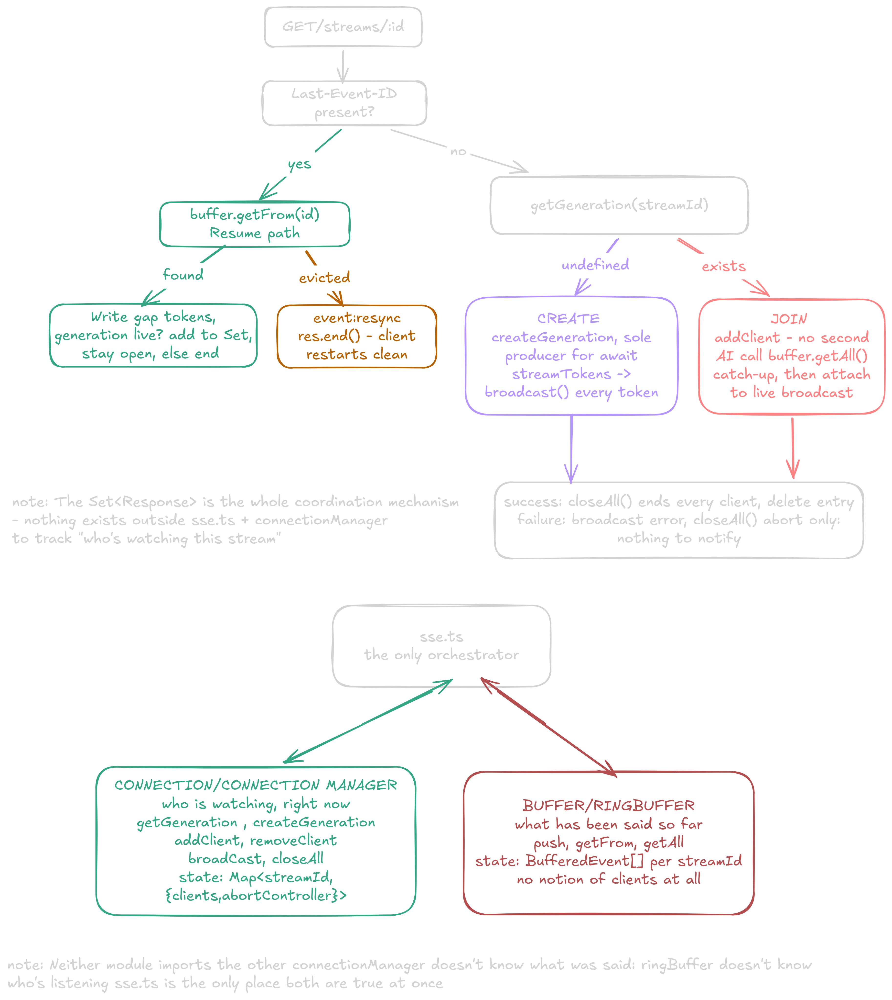

# Bug log

Building the Connection Manager fixed the fan-out bug above. It did not, on its own, get everything right the first time. Real multi-client curl testing surfaced six further bugs, each one a coordination assumption that stayed invisible until two clients genuinely overlapped in time.

1. The wrong AbortController got aborted

**Problem:** a joining client's own local AbortController, created fresh at the top of its own request, was never the one actually driving the shared generation. Calling .abort() on it was a silent no-op.
**Fix:** removeClient now returns the correct controller (the one stored on the Generation object) at the exact moment it determines the Set is empty — not left for the caller to look up separately afterward, since by then the entry may already be gone.

2. broadcast used where res.write was needed

**Problem:** resume replay, resync, and catch-up history were being sent via broadcast, which reaches every connected client, not just the one that asked. Already-caught-up clients silently received duplicate data every time someone else reconnected.
**Fix:** anything scoped to one specific client's own connection uses res.write()/res.end() directly; broadcast/closeAll reserved only for whole-Set delivery.

3. Success path never cleaned up

**Problem:** only the error path called closeAll. A generation finishing normally left every non-creating client's socket open forever, and the map entry was never deleted — a brand-new client arriving later would silently attach to a dead, finished generation and receive nothing, ever.
**Fix:** closeAll(streamId) now runs after the done broadcast too, not just on error.

4. Crash: removeClient throwing from an unpredictable, asynchronous call site

**Problem:** the strict requireGeneration throw is correct when a caller checks synchronously, in the same tick, right before acting. It's wrong inside req.on('close', ...), which fires later, asynchronously, and can legitimately run after closeAll already deleted the same entry through a separate, valid cleanup path. Two correct cleanup paths racing the same state meant the second one threw an uncaught exception inside an event-emitter callback — nothing could catch it, and the process died.
**Fix:** removeClient uses the soft getGeneration lookup and quietly returns undefined if the generation is already gone. "Already cleaned up by someone else" is an expected outcome here, not a bug.

5. CREATE branch ignoring Last-Event-ID entirely

**Problem:** the resume check only existed inside the JOIN branch. A reconnecting client whose generation had already finished (and been cleaned up per bug 3) landed in CREATE instead — which never looked at the header at all, and silently started an unrelated fresh generation instead of resuming.
**Fix:** the Last-Event-ID check moved to the very top of the handler, before CREATE/JOIN is even decided. Resume is a question that has to be answered before "who produces this" is asked.

6. Eviction and non-existence look identical from inside getFrom — and exposed a capacity problem, not a logic bug

**Problem:** buffer.getFrom(id) correctly returns null whether an ID was genuinely evicted or simply never existed — it can't distinguish "too old" from "never happened," and doesn't need to; resync is correct either way. What testing actually revealed was a capacity issue wearing a bug's clothes: a buffer capacity of 5 entries makes resume unrecoverable past a few seconds of lag for almost any real response.
**Fix:** none applied yet — flagged as a config decision to revisit once real token-size distributions are known, same open question as the byte-sized buffer alternative above.