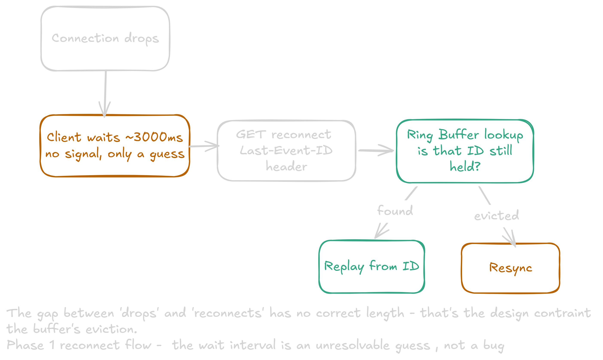
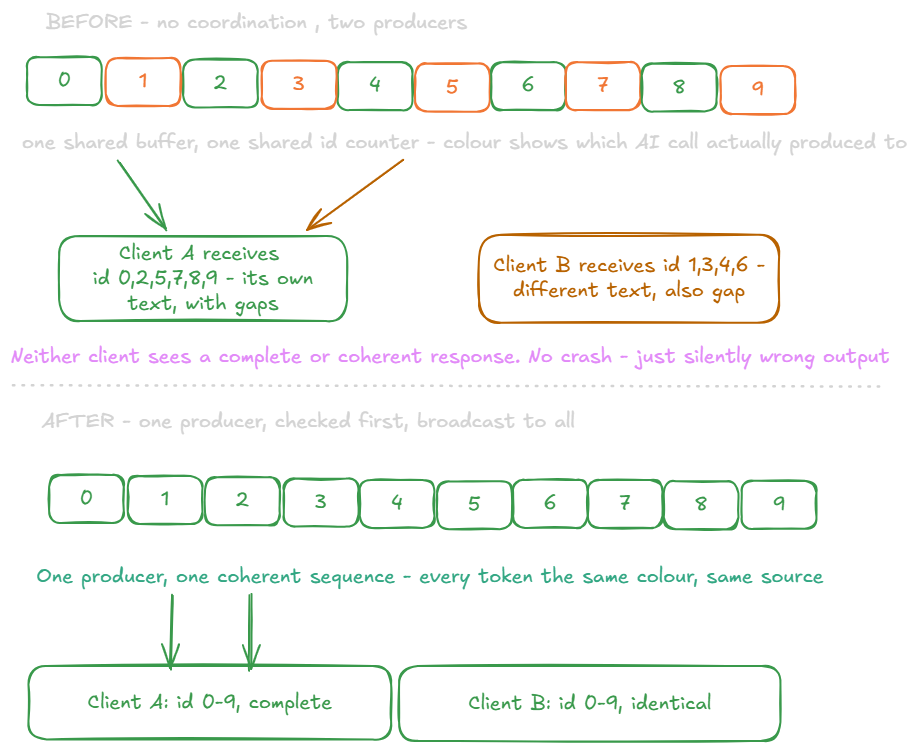
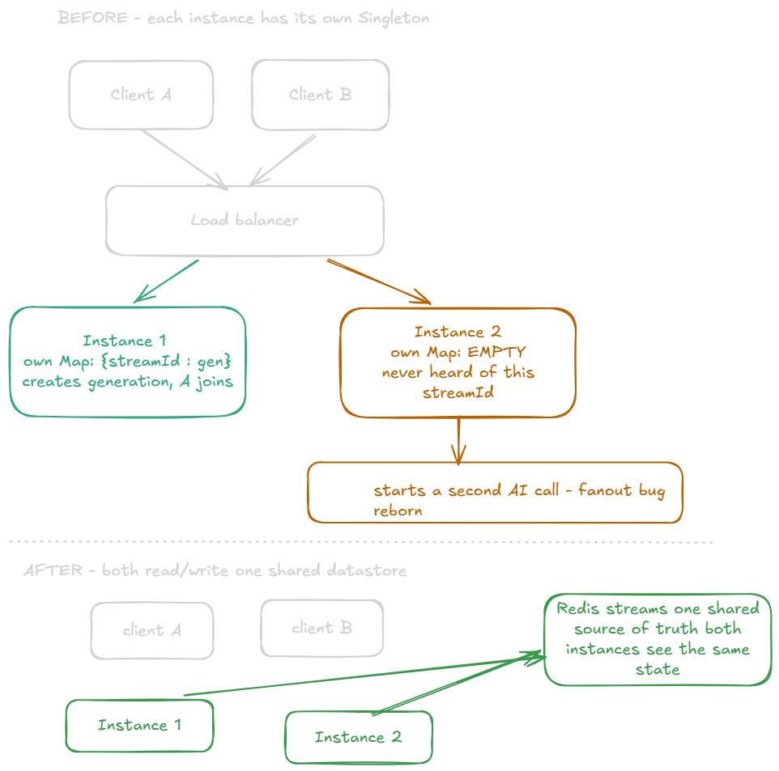
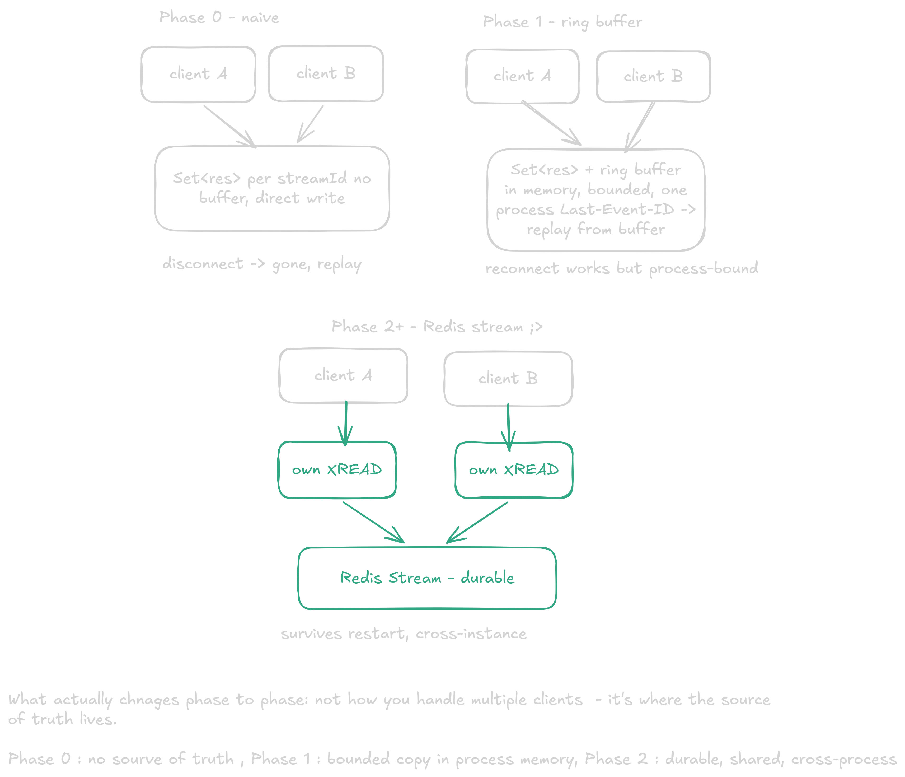

# Phase 1 - Reconnection with Last-Event-ID in-memory buffer

**Overview of the phase:**



**Decision:**

Two ring buffer designs, considered as code implementations:

-Fixed size in entries — the buffer holds the last N events; once full, appending a new one overwrites the oldest.
-Fixed size in bytes — the buffer holds, say, 64KB total. That could be 500 tiny token events or 50 large ones, depending on what's actually flowing through. Eviction is driven by total memory consumed, not by count.

I chose fixed size in entries for its simplicity. The tradeoff: no memory guarantee at all — 100 unusually large events could blow past a memory budget even though the entry count stayed fixed and within limits.

To implement this, I built a factory function that encapsulates the buffer's items. One function appends (overwriting the oldest entry once the max entry count is reached), and another replays events from a given Last-Event-ID.

**Alternatives Considered:**

The byte-sized buffer, rejected for Phase 1 specifically because it adds a second layer (memory) to reason about before the core resume mechanism (Last-Event-ID ->cursor->replay) is even proven out. This is worth while once a real token-size distribution is known. This is added complexity and for this phase the entry count buffer is fine.

**Deeper understanding:**

Two problems remain with either approach. First, this is still single-instance and in-memory, so a server restart loses everything. This is the same failure mode as phase 0. Second, because the buffer overwrites old entries, a client reconnecting after being gone for too long finds its Last-Event-ID already evicted, and receives a gapped stream rather than a complete one.

We don't use in-process pub/sub (an EventEmitter broadcasting to whoever's currently subscribed) for the live delivery path, because pub/sub is fire-and-forget: it reaches only listeners attached at the moment of emission, and drops the event for everyone else, that including a client that's mid-reconnect. What the ring buffer gives instead is closer to a replayable broadcast: several independent readers, each tracking its own cursor, replaying against one shared history-not a producer/consumer queue where a single consumer drains each item once. This matters going into phase 2: the Live Relay which will use XREAD with exactly this broadcast semantics(every client sees the full log), while only the Flush Job uses XREADGROUP's competing-consumer semantics(each entry divided round-robin across workers).

**How reconnection actually works, mechanically:**

Reconnection itself works through the GET request: the client resends the request with a Last-Event-ID header, and the server replays from that position. Every SSE event includes an id: field, which the browser's EventSource API stores automatically. If the connection drops and EventSource reconnects, the browser includes that stored ID as the Last-Event-ID header on the new request. The server reads the header and resumes sending from the right position in the stream, avoiding both data loss and duplicate delivery. Because the previous request already sent its FIN, this reconnect is a brand-new TCP connection, not a resumed one.

**Why the Connection Manager Exists - and why now, not deffered to phase2 [the problem found]:**

The paragraph above already says it almost by accident: "several independent readers, each tracking its own cursor, replaying against one shared history". This sentence describes a multi-client system. But nothing in the original ring-buffer-plus-resume design actually tracked multiple readers - it only tracked what had been said, never who was listening. Those are two seperate pieces of state, and I realised I had only built one of them :sweat:

The thing to note is that for a single client the gap doesn't show because with one reader there's nothing to coordinate. It only becomes visible the moment a second client connects to the same streamId, because at that point a real question exists for the first time: does this new connection see a fresh generation, or attach to the one already running? Every request, as originally written, silently assumed it was the only one. That assumption held for exactly as long as I only ever tested with one curl window open.

The Connection Manager (src/connection/connectionManager.ts) is the piece that makes that assumption explicit and enforceable instead of implicit and wrong. Its entire job, distilled: for any given streamId, know who is currently attached, and know whether a generation is currently producing. Concretely, client attach (addClient), client detach (removeClient, which also reports whether that detach was the last one), and delivery to everyone currently attached (broadcast, closeAll). This acquired 6 functions, each owning exactly one piece of that shared state.

Why build this now in Phase 1 rather than wait for Phase 2's Redis Streams to hand me the equivalent for free? There are 2 reasons. Firstly, multi-client broadcast is a real requirement - the reconnection model only makes sense if more than one reader can exist. Secondly, more importantly, building it by hand in-memory, first, is what actually revealed which coordination guarantees a tool like Redis provides for free and this would have abstracted the implementation. XREADGROUP's Consumer Group tracks "who's been given what" as a first-class concept; XREAD never divides delivery between callers at all. I didn't understand why those two commands behave so differently until I'd built the same distinction myself, by hand, and watched it break.

**The fan-out problem, visualised - understanding the problem:**

Before: two clients connect to the same streamId with no coordination between them. Each independently starts its own call to the AI provider. Both write into the same shared ring buffer, through the same shared ID counter — because nothing distinguished "a new reader of an existing stream" from "a request to start a new one." The counter doesn't know or care which generation a push came from; it just hands out the next number to whoever calls push() next. The result: Client A ends up with tokens 0, 2, 5, 7, 8, 9 — its own generation's tokens, but with gaps, because tokens 1, 3, 4, 6 were actually pushed by Client B's separate, concurrently-running generation. Client B sees the mirror image. Neither client receives a complete or coherent response, and — worse than a crash — nothing about this fails loudly. It just silently produces wrong output that looks plausible until you read the actual text closely enough to notice it doesn't cohere.



After: the Connection Manager's getGeneration check runs first. Client A's connection finds nothing for this streamId, becomes the sole producer via createGeneration. Client B's connection finds A's generation already running, and instead of starting a second one, calls addClient to join the existing Set<Response>. One producer loop, one shared ID counter used by exactly one writer, and broadcast() fans every token out to both clients identically. Both now receive 0 through 9, in order, complete, identical.

**Bugs surfaced through multi-client testing -Problem -> Code Fix:**


**What Broke, in the fault/failure frame:**

A fault is one component deviating from spec; a failure is the whole system stopping when it shouldn't. Phase 0 has nothing between the two- any fault becomes a failure instantly. Every later phase is a fault-tolerance layer. The ring buffer and Last Event ID resume is the actual fault-toleracne mechanism which converts the dropped connection into something that is short of data loss.

The Connection Manager's bugs above are the same framing, one layer over: not network fault this time, but concurrent access to shared state. A tool like Redis answers "who wins when two things touch the same state at once" exactly once, correctly, inside it own implementation, for every caller, forever.  Building this myself meant, everything abstracted becomes visible and testing this thoroughly highlighted the problems that needed to be solved. Arguably, this is the more fundamental of the two failure categories, since it's the one that shows up the moment more than one thing is happening at all, tool or no tool.

**Diving deeper into DDIA concepts and applying some terminology:**

**Naming the guarantee precisely:** This is linearizable not serializable. DDIA ch.9 (p.324) draws the exact line this bug sits on: linearizability is a single-object recency guarantee ("once one operation completes, everyone sees it immediately"), distinct from serializability (ch.7, p.251), which governs multi-step transactions appearing to run in some serial order. createGeneration's check-then-act race is an exmple from the book's own example for linearizability - an atomic compare-and-set on one key (p.325) - which is exactly what Redis's SET NX provides in Phase 2. This project's single Node process gets the same guarantee for free, not through any algorithm, but because JS's single-threaded event loop means nothing else can run between the check and the act - a 'leader of one' in the same sense that leader-based replication (ch.5,p.152) achieves linearizable writes by routing everything through a single arbiter, without any replication happening. 

**What broadcast() actually implements — Total Order Broadcast (ch.9, p.348):** DDIA defines it by two guarantees: reliable delivery (nothing dropped, every live recipient eventually gets every message) and totally ordered delivery (every recipient sees messages in the same order). That's the literal specification broadcast() has to meet — every connected client sees every token, in generation order, none silently dropped for one client while another gets it. The book treats this as a difficult distributed-systems problem because it's normally solved across independent, networked nodes with no shared memory. This project got it cheaply because there's no network in the loop at all — one process, one Set, one synchronous iteration. Phase 2 moving this onto Redis Streams' XREAD is what happens when that easy regime goes away and the same guarantee has to hold across genuinely separate processes.

**Why the Connection Manager's functions were cheap to fix, once found — Single-Object vs. Multi-Object Operations (ch.7, p.228) :** Every function here (addClient, removeClient, broadcast) touches exactly one Map entry for one streamId — never multiple keys together. DDIA's distinction between single-object operations (atomic "for free" in most systems) and multi-object operations (needing real transactional machinery to stay consistent) is why none of these bugs needed anything heavier than a careful guard clause and a correctly-ordered return value — the more difficult, multi-object version of this problem never really existed here.

**Some more interesting DDIA reading:**

-ch8, The Trouble with Distributed Systems - in an asynchronous network, the server can't distinguish 'slow' from 'dead' from silence alone, because no universal timeout value exisits - too short and you get false positives(killing a connection that was just momentarily slow), too long and dead connections sit open, holding resources for nothing.

The chapter's big-picture list of what can go wrong, and how it maps onto this project:

-Unreliable networks- machines communicate over network with no shared memory, only message passing. TCP guarantees reliable, in-order delivery within one connection, but that guarantee doesn't survive the connection itself breaking (cable unplugged, host crash, network partition). When that happens you get a timeout, not confirmation of what was or wasn't received - the sender genuinely doesn't know whether the last packet arrived. In our system: the connection to the AI SDK call in a stream producer component that writes responses directly to the durable log instead of relying on that one fragile connection to deliver them.

-Lost or delayed messages- a packet sent over the network may be lost or delayed; so may the reply. If no reply arrives, the sender has no way to distinguish 'message never arrived' from 'message arrived, but the reply got lost'

-Retransmission can cause duplicates - and the sender still has no way of knowing exactly how much the remote node actually processed before whatever went wrong

-Clock skew - a node's clocks can drift out of sync with other nodes even with NTP (Network Time Protocol) running, and can jump forward or backward. Relying on wall-clock time is risky because you rarely have a good bound on your own clock's error. This is low relevance to this project right now: Redis Stream IDs are centrally generated by one Redis Instance, so ordering doesn't depend on comparing clocks across nodes. This becomes relevant only if the architecture goes multi-instance/multi-region later

-Process pauses - a process can pause for a substantial stretch at any point in its execution (GC pause, OS scheduling, VM suspension), get declared dead by other nodes, and then resume without ever realizing it was paused. The fix for the analogous problem is the Resume Handler : it doesn't try to detect why a client went quiet, it just resumes cleanly from Last-Event-ID whenever it comes back.

The unifying idea is determinism. Concurrency, network delay, process pauses, clock jumps, and crashes are all sources of nondeterminism — and nondeterminism is the root cause behind essentially every distributed-systems failure mode above. Where we get determinism back in this system: replaying a deterministic log of events lets us reconstruct exactly the same state after a network drop, rather than trying to guess what was lost. The Connection Manager's bugs above are this same idea at a smaller scale: every one of them was nondeterminism (which request runs first, which cleanup path wins the race) becoming visible only under real concurrent load.

**Node.js Design Patterns applied from the book [the magic underneath]:**

Singleton pattern applied here , simply put a pattern that limits a class or object to one single instance and gives a global way to access it. In Js you don't need to construct a private constructor or an instance-check to achieve this. Simply declaring a stateful value at the top of a module and never exporting it directly - only exporting functions that touch it - is already a singleton because Node caches modules and only ever runs their code once.

Example, stripped down to the idea:

```javascript
// connectionManager.ts
const generation = new Map() // declared once, lives for the life of the process

export function addClient(streamId, res) { /* reads/writes `generation` */ }
export function broadcast(streamId, chunk) { /* reads `generation` */ }
```

Every file that does import { addClient } from './connectionManager' is touching the exact same Map, because Node only executes this module's top-level code the first time it's imported, and hands out the same cached result every time after. That's the entire mechanism — no special pattern was consciously applied, it's just how the module system works. This explains why one Map in one file correctly coordinates every request handler that imports it.

**The limitation this Singleton doesn't have yet, but will - 'Dealing with stateful communications (ch.12, p.552-556):**

The book's own example (NDJS): a user logs in, and the instance that handled the request stores "this user is authenticated" in its own memory. The load balancer sends their next request to a different instance — which has no memory of that login at all, and rejects them. Nothing was wrong with either instance individually; the problem is that state lived in one process's memory, and a second process was asked about it.

If we subsitute streamId's generation for "logged in," and this is exactly what would happen to the Connection Manager the moment this app runs as more than one Node process (e.g. horizontally scaled behind a load balancer):

Client A connects, gets routed to Instance 1. createGeneration runs there — the Map on Instance 1 now knows about this stream.
Client B connects a moment later, wanting to watch the same stream, but the load balancer happens to route them to Instance 2.
Instance 2's generation Map has never heard of this streamId — it's a completely separate, empty Map, because Singletons are only shared within one process, not across processes.
Instance 2 has no way of knowing Instance 1 is already generating this response, so it does exactly what the original fan-out bug did: starts a second, unrelated AI call.

This is the same concurrent-generation bug from earlier in this document, reappearing at the infrastructure level — not something a code fix inside connectionManager.ts can solve, because the bug wouldn't be in the file's logic; it'd be that two different processes each hold their own un-synchronized copy of the same Singleton.



The book provides two solutions (p.553–554): a shared datastore every instance reads and writes instead of local memory — Redis or sticky load balancing, pinning a session to one specific instance so it never needs to ask another one. The book calls sticky sessions "usually not recommended," becse it's tying a client to one instance defeats a lot of the point of having redundant instances in the first place.

This is a real, not-yet-hit limitation worth pointing out: this project cannot currently run as more than one process without silently reintroducing the fan-out bug. Phase 2's move to Redis Streams isn't only solving durability - it's also what makes horizontal scaling possible at all, by replacing the in-process Singleton with a shared datastore every instance reads from, exactly what the book recommends.

**Code practise:**

Mainly used [SSE guide](singhajit.com/server-sent-events-explained) to understand reconnection and wire that logic in sse.ts. Use claude to assist in debugging :wink: and assist me in helping solve the problem.

**The phase evolution [about to get interesting :wink:]:**


**The file structure:**

ai-sse-streamer/
├── src/
│   ├── ai/aiProvider.ts          # unchanged
│   ├── buffer/ringBuffer.ts      # capacity currently 5 — revisit once real token-size distribution is known
│   ├── connection/connectionManager.ts   # NEW — client attach/detach, broadcast, generation lifecycle
│   ├── routes/sse.ts             # wired buffer + connectionManager logic
│   └── server.ts                 # unchanged
├── client/index.html             # unchanged
├── docs/decision.md
└── .env

**The next phase:**

Phase 0 had no memory of anything sent — disconnect and the tokens were just gone. Phase 1 adds three things on top of that same pipeline: a ring buffer that lets a reconnecting client replay from where it left off, a Connection Manager that makes "who's currently listening" an explicit, coordinated piece of state instead of an unstated assumption, and the multi-client broadcast semantics that only became provably correct once real concurrent testing forced every one of those coordination bugs into the open.

The thing that still hasn't changed is the actual point of the phase: durability. Everything — the ring buffer's contents and the Connection Manager's Map of who's attached still lives in one process's memory. A server restart, or a gap longer than the buffer's capacity, loses data exactly the same way Phase 0 did; a restart now also silently forgets who was connected, not just what was said. That gap is what Phase 2 closes by moving both jobs, the log, and the coordination onto Redis, where XREAD's broadcast semantics and XREADGROUP's competing-consumer semantics are guarantees the tool provides, not something I'd have to do myself.