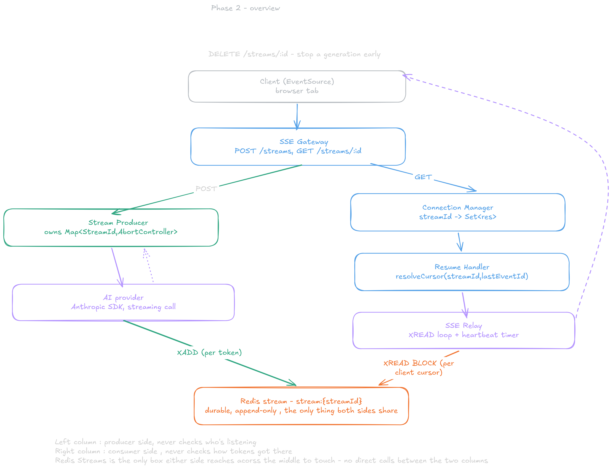
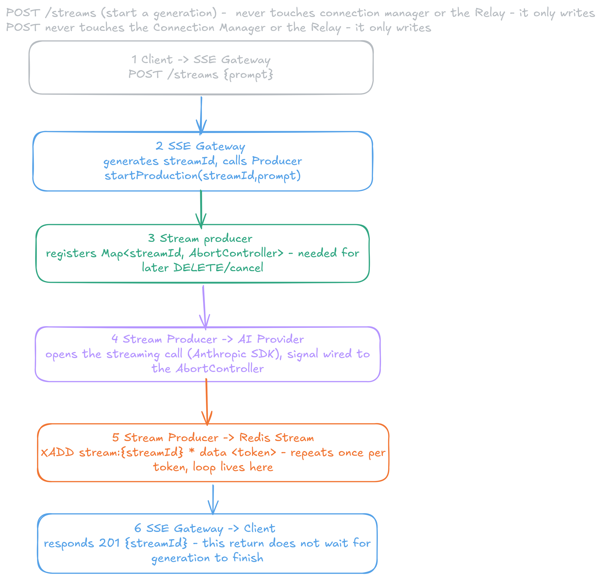
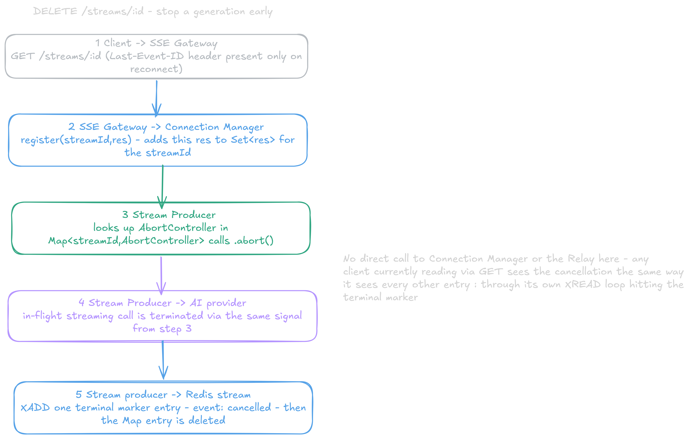
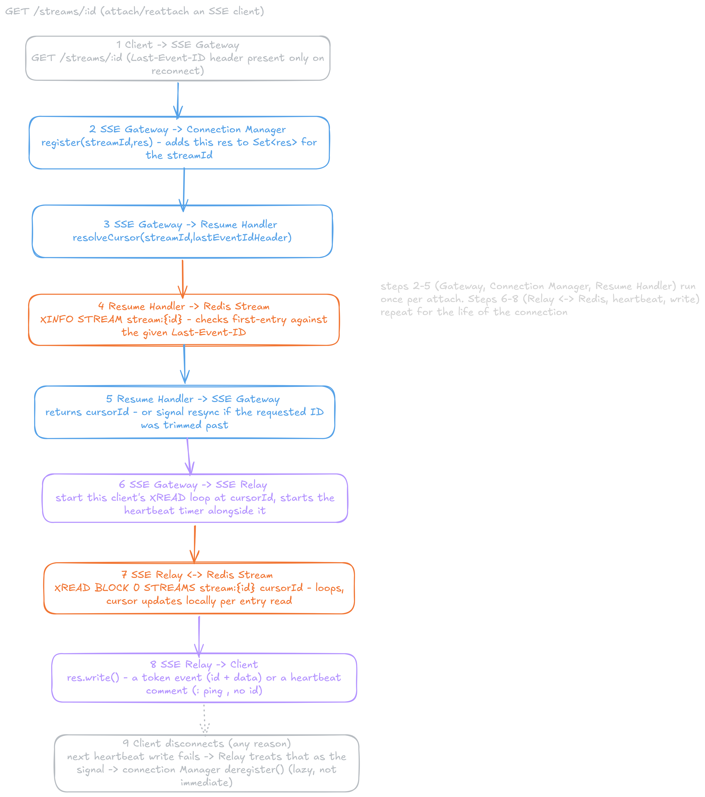
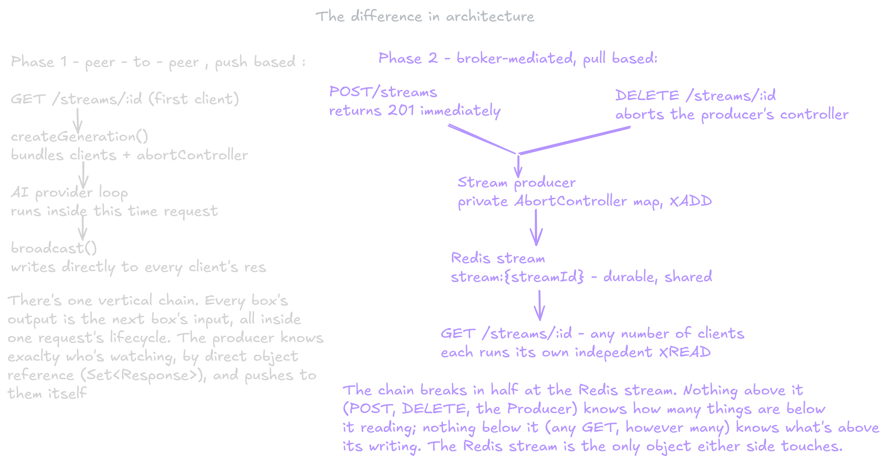

# Phase 2 - Adding the durability layer 

pffttt this phase was hella work. From learning about different testing strategies to an actual architectural shift from a push-based model to a pull-based one. Ngl, this is where I heavily used Claude, vigorously butchering it in the process. Testing was genuinely a new, backward way of thinking, which is quite difficult — especially integration tests, and anything with side effects like time where you have to mock things. I didn't write all of them myself — some of the unit tests I had a go at, but not the others. Pure functions are unit testable. But that's not really the point, and I don't mean to complain — the main point of this phase was adding a durability layer in the form of Redis Streams, which replaced the ring buffer and its in-process, memory-bound issues. A Redis Stream is an append-only data structure — fast, reliable, RAM-based. I containerized the Redis instance so the setup is saved somewhere; if we didn't, on server restart the instance wouldn't survive, we'd lose our data, and that defeats the whole point for our Resume Handler, where we want to replay history from a given Last-Event-ID.

**Overview of the phase:**



**Core components and what their purpose is:**

-Resume Handler - resolves the cursor pointer given a last event id is present , if none then we know it's a fresh connection. If one is present, we also need to check if it's stale - and to do that we compare using XINFO STREAM's first-entry. It's not last-entry - it should be first-entry: MINID trims from the oldest end, so first-entry is the actual surviving boundary. last-entry is the newest write, which tells you nothing about what got trimmed.

-Connection Manager -largely simplified, since Stream Producer now stores the AbortController state at the start of production. Connection Manager is only interested in storing the client response, which gives it a single responsibility: register, deregister and getConnections.

-StreamProducer- the producer that records tokens and stores them in Redis, initiated by the POST handler. Each write bundles XADD, INCR (the token counter), and XTRIM, where we cut off the stream after a set period — 24 hours in our case. 'Transactional' here MULTI/EXEC guarantees no interleaving with other clients, it's not SQL style rollback. If XADD succeeds and INCR fails, the token's still durably in there regardless. startStreamProduction is a wrapper around the AI provider, and each token gets written to the records as it comes in. stopStreamProduction aborts the controller. I also have terminal markers which add event types to Redis so the client knows the state of the stream. Once a stream is cancelled, the final token count gets embedded in that cancelled marker. This now has its own private state with AbortController, which Connection Manager previously held.

**Routes - split, single responsibility:**

Everything used to be done in the SSE handler, which initially added alot of edge cases to think about. Now:

**2 short-lived REST endpoints:**

-POST endpoint - now solely responsible for the creation stage. Fire-and-forget: immediately returns the streamId, runs production in the background - a producer of a kind.



-DELETE endpoint - stops streams production



-SSE endpoint - still alot going on ;>



The Producer's XADD loop and the Relay's XREAD loop can be running concurrently, on different clients, against the same Redis stream - that's the whole point of decoupling them through Redis instead of a direct in-process call. A client can GET a streamId before, during, or after the POST that's still producing into it, and the flow above doesn't change either way - only how much history XREAD returns immediately differs.

The SSE endpoint contains the SSE Relay, which is responsible for reading the stream and getting it to the client. We also have a heartbeat timer - per Kleppmann, at the TCP level you can have network issues with no way of signalling that to the client, which is why we have a heartbeat firing at an interval. That's the actual problem distributed systems run into: no reliable way to tell 'slow' from 'dead' over a network (DDIA, ch.8 - timeouts and unbounded delays). The duration threshold for "this client's been quiet too long, tear it down" is a Backpressure Controller concern, which is the next phase.

A word on backpressure and why it's relevant to streaming - this is Phase 3's actual problem, but worth stating since it's relevant to the heart beat interval.

NJDP ch.6 (Coding with Streams, p.197–199) names the mechanism directly: Node streams buffer data in memory, and without feedback from the stream back to the writer, that buffer can grow unbounded. Writable streams solve this with a built-in signal — res.write() returns false once the internal buffer exceeds highWaterMark (16 KB by default), telling the application "stop writing, wait for the buffer to drain." Once it clears, a 'drain' event fires, and it's safe to write again. The book is explicit that this is advisory — nothing forces you to respect it; ignoring false and writing anyway just lets the buffer grow indefinitely regardless.

Why it actually matters for this project specifically, not just as a Node curiosity: our Relay's XREAD loop writes a token to res every time one arrives, no pacing at all right now. If one connected client is on a slow network and another is fast, the slow one's buffer can grow unbounded while the loop keeps writing regardless — backpressure is what stops that, per-connection, without needing to slow down or affect any other client watching the same stream.
 
 **A word on some Redis commands:**

-Writing, the only way data enters the stream — XADD, producer/streamProducer.ts — appends one new entry. Called with * for the ID (Redis auto-generates a monotonic timestamp-sequence pair) and MINID ~ <24h-ago-id> on every call, so trimming happens as a side effect of normal writes. The sole purpose of this is the entire "producer" side of the architecture — nothing else writes to a stream. One call per token, in the loop that replaced res.write() from Phase 0/1.

-Reading, broadcast-shaped - what the Live Relay actually runs : XREAD (with BLOCK 0) - routes/sse.ts - pulls every entry after a cursor you hold locally, blocking until new data arrives instead of polling. The sole purpose of this is that one independent read loop per connected client which makes 'many subscribers, each at their own position'

-Introspection - read-only , no cursor movement : XINFO STREAM - consumer/resumeHandler.ts - returns the metadata about the stream itself : first-entry, last-generated-id, length. The sole purpose of this is answer one binary question before resuming - is the client's Last-Event-ID still inside the stream, or has it been trimmed past? There's no 'trimmed' flag returned, you compute that by comparing the client's ID against first-entry yourself.

-Bounded range reads - a fixed window, not a live loop: XRANGE gives a bounded slice once , never for continuous consumption - that job belongs to XREAD. Used in the testing script which reads the cursor ID directly via XRANGE ... COUNT 1 instead of racing to capture a live id: line off a streaming connection - a deterministic read replacing a flaky one. 

**Things learnt probably alot but won't pollute this log, just something new:**
 
 -Different testing strategy , that way of backward thinking, figured out testing pure functions but the rest was quite difficult to grasp. Some patterns figured that I will reuse : pure unit (nothing to fake), integration against real Redis (when point is proving Redis itself ends up right), unit with a dependency fully mocked and supertest for route wiring specifically.

-Thought MULTI/EXEC gave me SQL-style rollback. However it doesn't- it only guarantees no interleaving. If XADD lands and INCR fails, the token's still there. Had to actually state this instead of assuming it.

// talk about asynchronous programming here 

**Before and after architectural shift:**



Phase 1 was push-based and peer-to-peer, one shared object, one loop pushing directly to every connected client. Phase 2 is pull-based and broker-mediated - Redis is the only thing either side touches, nobody pushes to anybody. The entire shape is pub/sub and is a distributed observer pattern which ties back to the exact observer/event emitter reasoning back in phase 0.

**File structure:**

```
ai-sse-streamer/
├── src/
│   ├── ai/
│   │   └── aiProvider.ts        # unchanged
│   ├── redis/
│   │   ├── client.ts            NEW — shared Redis connection
│   │   └── streamKeys.ts        NEW — key naming + MINID trim policy
│   ├── connection/
│   │   └── connectionManager.ts NEW — register / deregister / getConnections
│   ├── producer/
│   │   └── streamProducer.ts    NEW — XADD loop, replaces res.write()
│   ├── consumer/
│   │   └── resumeHandler.ts     NEW — Last-Event-ID → cursor via XINFO STREAM
│   ├── buffer/
│   │   └── ringbuffer.ts        # resolve: delete, keep, or repurpose
│   └── routes/
│       ├── sse.ts               GET /streams/:id only
│       └── streams.ts           NEW — POST /streams (start), DELETE (stop)
├── server.ts                    # unchanged
├── client/
│   └── index.html               # unchanged
├── docs/
│   └── decision.md              # Phase 1 entry owed, Phase 2 entry once built
└── .env                         # unchanged
```

Next phase is all about backpressure ;>